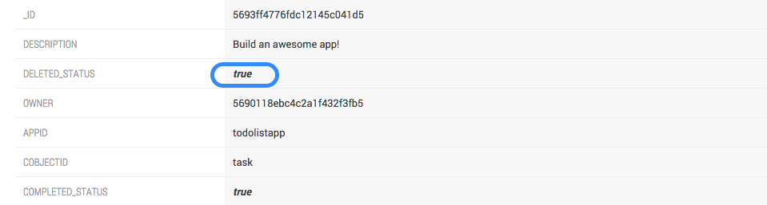

# Angular-To-Do-App
A tutorial on how to create a to-do app with Angular.js and Stamplay

##Overview
This application can sign up users, as well as create, complete, and delete tasks from a list. Angular combined the Stamplay Javascript SDK will be used
to write the front-end code, while Stamplay's platform will handle all of our server side logic. This means that we will not write any back-end code, instead
we will use the GUI provided by Stamplay to configure our back-end in just minutes. That's right, a full stack app with no back-end code!

##Configuring the back-end with Stamplay's platform
1. Login to your Stamplay account. If you don't have one, sign up for free at http://stamplay.com
2. Create a new app
3. Go to **Objects** and then *+ New*
4. *Name* your object "task"
5. Assign *property* of "description" to *type* of "String"
6. Assign *property* of "completed_status" to *type* of "Boolean"
7. Assign *property* of "deleted_status" to *type* of "Boolean"


8. Now that the object model is made, we need to test this schema. Go to the **API Console**
9. The *API Console* serves as a tool for developers to make HTTP requests from Stamplay's platform to speed up the testing/development
process. Under the *Operation* dropdown select *Create Object*
10. Select "task" as the object instance, then fill out the property fields with random values. Hit **Send**
11. Go to **Data** and then *Objects*. View object detail, see how it matches with the object model "task"


##Bringing in the front-end code and using the SDK

###Initialize App
- Clone this repo by running the below command in your command line
```
git clone https://github.com/isaacg11/Angular-To-Do-App.git
```
- Install all dependencies via bower
```
bower install jquery
bower install angular
bower install angular-ui-router
bower install angular-stamplay
```
- install command line tool for Stamplay
```
 npm install -g stamplay-cli
```
- Initialize front-end of app with Stamplay by running the below command in your command line
```
stamplay init
```
Then you will be prompted to enter your AppId and your API Key. These can be located on the first view of your app in the Stamplay editor. Enter AppId and API Key in command line.


###The Javascript SDK
- Next, we need to bring in the Stamplay SDK library by copying the CDN provided below and pasting in into the **index.html** file. Alternatively, you may install it with bower if you prefer.
```
<script src="//drrjhlchpvi7e.cloudfront.net/libs/stamplay-js-sdk/1.3.2/stamplay.min.js"></script>
```
- Now we need to initialize the SDK library with our specific app. To do this, enter *Stamplay.init('yourAppId')* on the top of your **Javascript files**. (both controllers & services will need this)
```
Stamplay.init('yourAppId')
```
###Local Development & Hosting
- Now that we have everything set up, we can now run our app on the local server by running the below command:
```
stamplay start
```
- Next, we can deploy this app live by entering the below command:
```
stamplay deploy
```

###Signup New Users
- Now that the app is up and running in the browser, time to test it out! First, start by creating a new user account


- Now, go back to the Stamplay editor and view the **Data** section under *Users*. See new user info.


- Below is the code to *signup new users*. Simply pass in a email & password and Stamplay takes care of password security/encryption, email verfication, ID assignment, and much more back-end functionality.

```
$scope.login = function() {

    var registrationData = {
      email: $scope.em,
      password: $scope.pass
 };
 
 var user = new Stamplay.User().Model;
      user.signup(registrationData); //HERE IS THE SDK FUNCTION FOR USER SIGNUP
 ```
###Add a Task

- Once we are logged in, we are ready to create a task. Enter a task description in the input field and click the *Add* button


- Now that we can see the Task on the view, go to **Data** then *Objects* and view the new task object.


- Below is the code for adding a task (creating an object). Simply pass in a value for a Stamplay object property and save it to the database.

```
$scope.addTask = function(newTask){ 
      var taskInstance = new Stamplay.Cobject('task').Model;
      taskInstance.set('description', newTask);
      taskInstance.set('deleted_status', false);
      taskInstance.save();
}

```
###Complete a Task
- For completed tasks, we will use a visual strike-through to seperate the completed tasks from the incomplete. Click the checkmark to complete the task.


- Next, back to the Stamplay editor and look at **Data** then *Objects*. See how the property "completed_status" changed to "true"


- Below is the code to complete a task (update an object). You simply fetch a task by it's Id, assign a property a new value, then save to the database.

```
$scope.completeTask = function(id){
      var completed = true;
      var taskInstance = new Stamplay.Cobject('task').Model;
      taskInstance.fetch(id).then(function(){
        taskInstance.set('completed_status', completed);
        taskInstance.save();
      }
 }
```
###Delete a Task
 - For deleted tasks, we will perform a soft delete. Meaning we will remove the task from the user view but won't delete the object in our database. Instead, we'll just filter out the deleted tasks with the property "deleted_status". Delete the task by clicking the "X"


- Now that we can no longer see the task, go to **Data** then *Objects*. See how the property "deleted_status" changed to "true"



- Below is the code for deleting a task (updating an object).

```
$scope.deleteTask = function(id){
      var deleted = true;
      var taskInstance = new Stamplay.Cobject('task').Model;
      taskInstance.fetch(id).then(function(){
        taskInstance.set('deleted_status', deleted);
        taskInstance.save();
      }
 }
```
###Display Tasks
 - Now that we've seen full CRUD operations, next we need to see how to display tasks on page load. The 2 filters we are going use are: (1) We only want to GET the tasks that belong to the user who is logged in. (2) We only want to get the tasks with a "deleted_status" of true. To make them display on page load, we will write an anonymous function. Below is the code to display tasks under these conditions.
 
```
//CONTROLLER
$scope.allTasks = $scope.allTasks ? $scope.allTasks : [];

homeFactory.getUser().then(function(user) {
    if(user.isLogged()) {
      $scope.userName = user.instance.email;
      homeFactory.getTask().then(function(tasks) {
        $scope.allTasks = tasks;
      });
    } else {
      console.log("Login to continue.");
    }
});


//FACTORY
getUser : function(){
      var q = $q.defer();
      var user = new Stamplay.User().Model;
      user.currentUser().then(function(){
        q.resolve(user);
      });
      return q.promise;
},
getTask : function() {
      var q = $q.defer();
      var taskCollection = new Stamplay.Cobject('task').Collection;
      var user = new Stamplay.User().Model;

      user.currentUser().then(function(){
          taskCollection.equalTo("owner", user.get("id")).
            equalTo("deleted_status", false)
            .fetch().then(function(res){
              q.resolve(taskCollection.instance);
            });
        
        });
      return q.promise;
 }

```

##Conclusion
As you can see, we were able to create a fully featured app in very little time with no back-end code! This is just a peek at some of the great features available to you on Stamplay's platform. 
See live DEMO at https://todolistapp.stamplayapp.com
